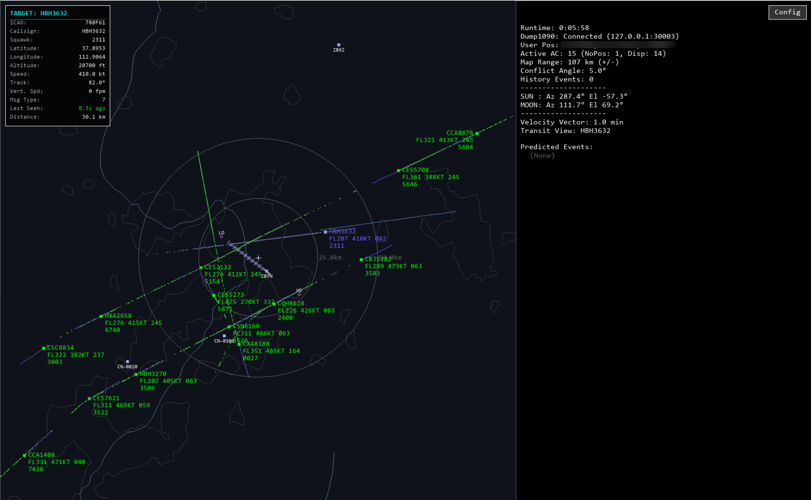
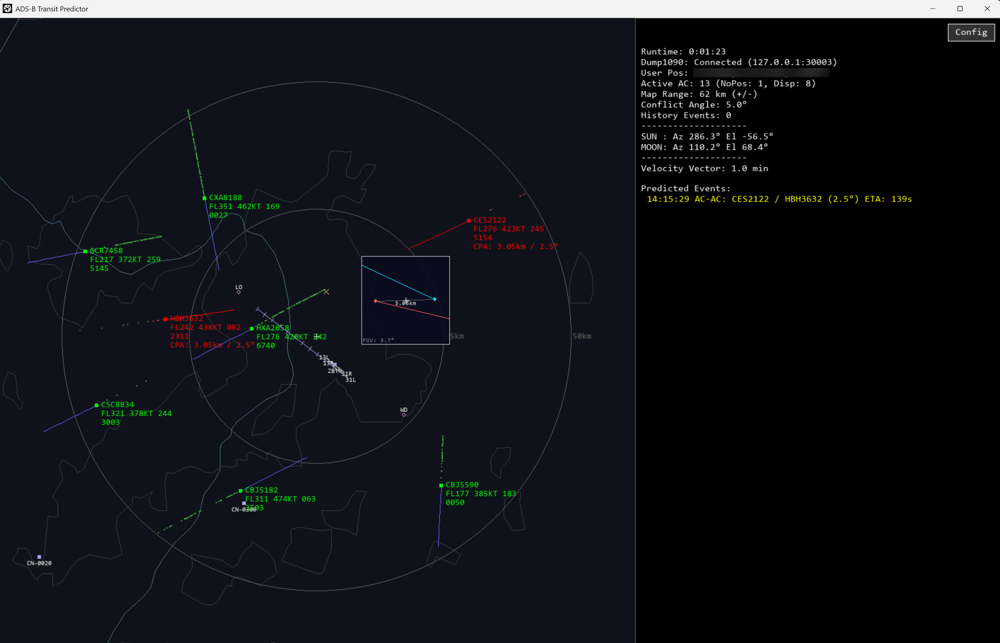
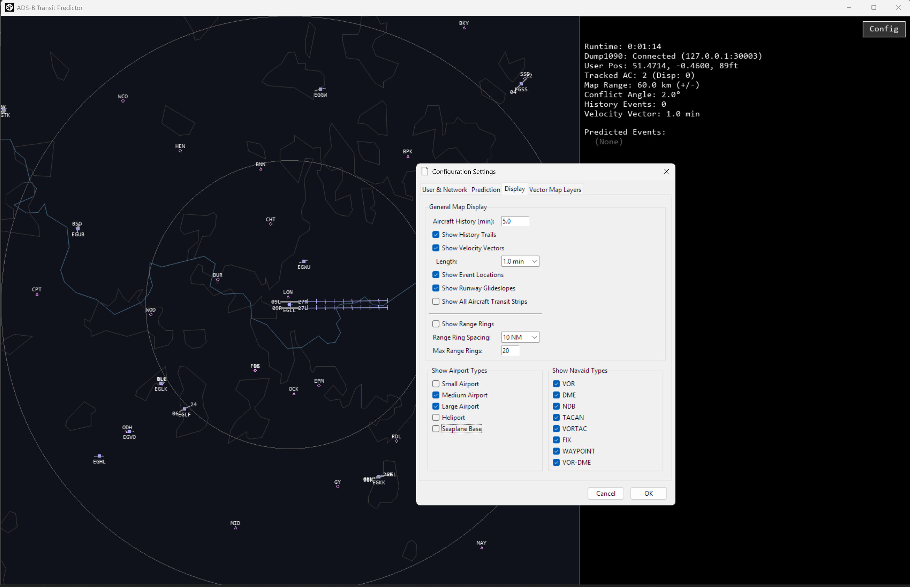

# ADS-B Transit Predictor

A real-time visualization tool for predicting aircraft transits across the sun and moon, and close encounters, using live ADS-B data.

## Motivation
As an aviation enthusiast and photographer, I was fascinated by two distinct and technically demanding photographic challenges: capturing the rare moment two aircraft appear to have a close encounter, and capturing the dramatic transit of a single aircraft across the sun or moon. Both types of events are incredibly fleeting, lasting only seconds, and their visibility is entirely dependent on the observer's precise location and timing. I realized that a purely observational approach was not just inefficient, but fundamentally limited by chance. This project was born out of a desire to create a scientific tool to solve this problem—to move from serendipity to predictable, planned photographic opportunities. The software achieves this by fusing real-time aeronautical data (ADS-B) with predictive geometry and celestial mechanics.

## What's New in v1.2
*   **Faster Map Rendering:** Rewrote the map rendering pipeline using **NumPy vectorization** and **spatial indexing (BBox Culling)**. High-precision vector maps now load and render smoothly without simplification.
*   **Simulated POV Preview:** Added a "Point of View" tactical display. When an event is predicted, the software simulates a camera viewfinder perspective (Azimuth/Elevation), showing exactly how the aircraft will cross the celestial body or pass each other.
*   **Aircraft Information Panel:** Added a detailed information panel displaying real-time telemetry (ICAO, Callsign, Squawk, Speed, V/S) and distance for the selected target.
*   **Precision Algorithms:** Migrated core collision and transit detection to the **Skyfield WGS84 ellipsoid model** and implemented Golden Section Search. This eliminates parallax errors and achieves millisecond-level precision for the Time of Closest Approach (TCA).

## Key Features
*   **Real-time Flight Tracking:** Establishes a direct connection to a local dump1090 ADS-B decoder. It renders live positions on a dynamic map and provides a info panel for detailed telemetry of selected aircraft. 
*   **Transit Prediction:** For any detected aircraft, the software calculates and visualizes its future ground shadow track across the Sun and Moon. This "transit corridor" uses multi-segment polyline fitting to show an observer exactly where to be on the ground to witness the event.
*   **Aircraft-to-Aircraft Close Encounters (AC-AC):** Continuously monitors flight paths to detect rare moments of visual convergence. It utilizes algorithms to solve for the **Closest Point of Approach (CPA)** between two aircraft, alerting the user to these fleeting "crossover" photo opportunities.
*   **Tactical POV Schematic:** A new "Point of View" visualization simulates the camera viewfinder perspective (Azimuth/Elevation) for predicted events. It shows the exact geometry of aircraft transits or close encounters, including relative velocity vectors and separation angles.
*   **Geospatial Context:** Integrates a multi-layered map with foundational vector data from Natural Earth (coastlines, borders) and a comprehensive aeronautical database from the OurAirports project (airports, runways, navaids).
*   **Integrated ADS-B Receiver:** The Windows release package comes bundled with a pre-compiled version of dump1090, providing an "out-of-the-box" experience for users with an RTL-SDR dongle.

## Technical Stack
This application utilizes a combination of Python libraries and scientific models:

*   **Core Logic:** Python 3
*   **Real-time Rendering & UI:** Pygame for the main display; **NumPy** for high-performance vectorized map rendering and coordinate projection.
*   **Configuration:** Tkinter / ttk for user-friendly configuration menus.
*   **Celestial Mechanics:** **Skyfield** for high-precision astronomical calculations (using JPL DE421 ephemeris) and **WGS84** geodetic conversions.
*   **Geospatial Analysis:** Shapely and PyShp for processing vector map data.
*   **Networking:** Python's built-in socket library for streaming raw data from dump1090.

## Screenshots

### Main Application Interface

*The main interface showing live aircraft, transit corridors, and the new high-performance vector map.*

### POV Encounter Preview

*The new tactical POV display showing a predicted aircrafts close-approach event with velocity vectors.*

### Configuration Menu

*
The configuration menu, allowing for customization of user location, prediction parameters, and map layers.
*

### Examples

*
A screenshot displaying a B747-8F and an IL-76 in close proximity.
*

## Getting Started

### For End Users (Windows)
1.  Navigate to the project's [Releases page](../../releases).
2.  Download the latest `ADS-B_Transit_Predictor.zip` file from the "Assets" section.
3.  Extract the `.zip` file to any location on your computer.
4.  Open the folder and double-click `ADS-B_Transit_Predictor.exe` to run.

## Acknowledgements

*   **AI-Assisted Development**: This project's development was accelerated by leveraging Google's **Gemini 2.0 Flash** and **Gemini 2.5 Pro** models for tasks such as code optimization and documentation generation.
*   **Data Sources & Scientific Models**:
    *   The foundational vector map layers (coastlines, borders, etc.) are sourced from [**Natural Earth**](https://www.naturalearthdata.com/).
    *   The comprehensive database of airports, runways, and navaids is provided by the [**OurAirports**](https://davidmegginson.github.io/ourairports-data/) community project.
    *   Celestial body positions are calculated using the **JPL DE421 ephemeris** provided by NASA.
    *   Geodetic calculations adhere to the **WGS84** Earth ellipsoid model.
*   **ADS-B Decoding**: The software bundles and utilizes **dump1090**, an open-source ADS-B decoder written by Salvatore Sanfilippo (antirez@gmail.com) and distributed under its original **BSD 3-Clause license**.

---

## License

This project is licensed under the [MIT License](LICENSE).
