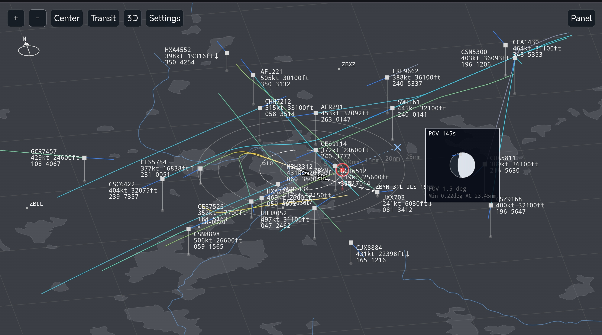
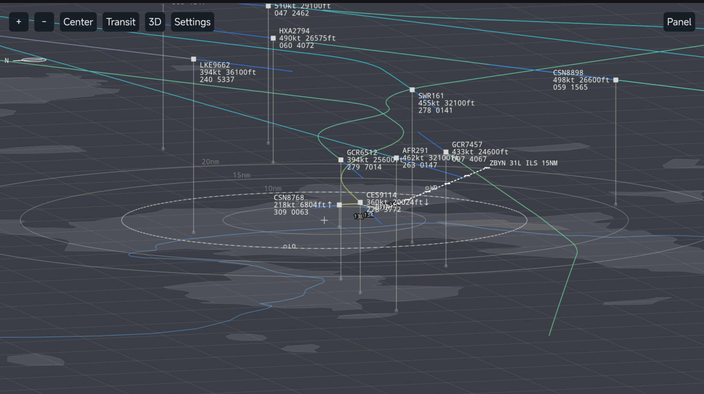
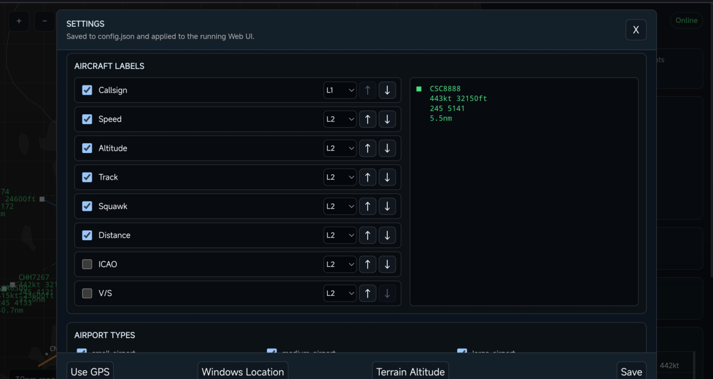
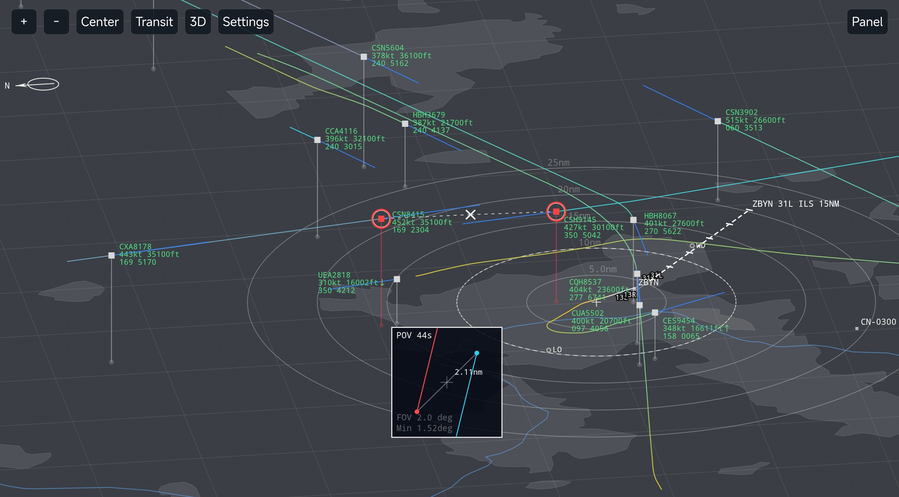
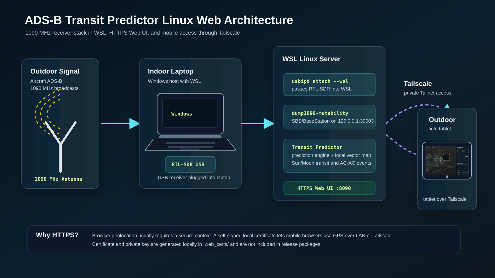
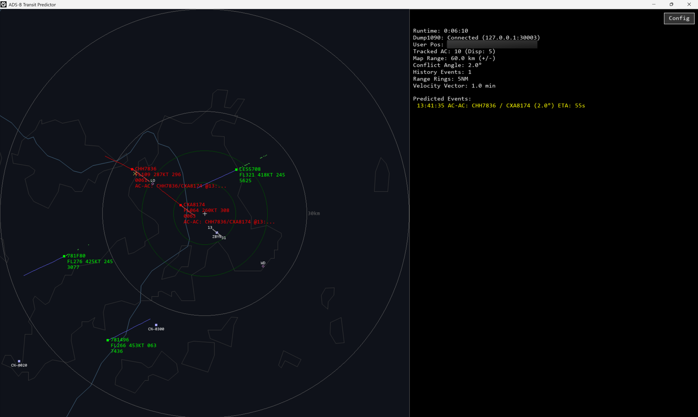
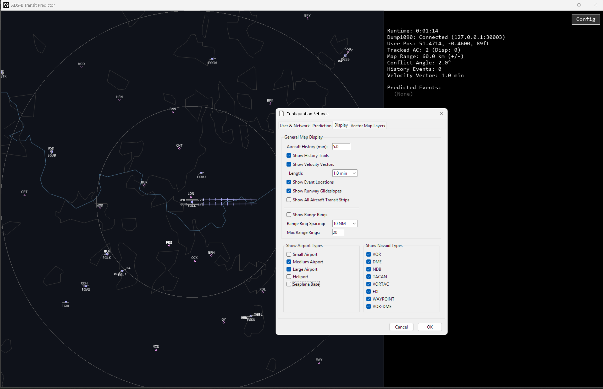
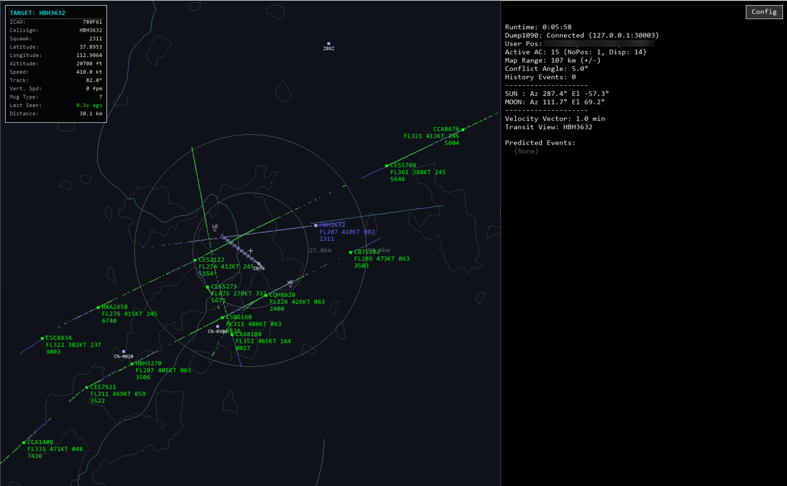
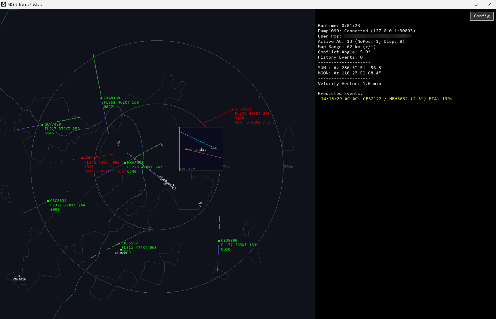

# ADS-B Transit Predictor

<p align="center"></p>

A real-time visualization and prediction tool for aircraft transits across the Sun and Moon, plus aircraft-to-aircraft close visual encounters, using live ADS-B data.

## Motivation
As an aviation enthusiast and photographer, I was fascinated by two distinct and technically demanding photographic challenges: capturing the rare moment two aircraft appear to have a close encounter, and capturing the dramatic transit of a single aircraft across the sun or moon. Both types of events are incredibly fleeting, lasting only seconds, and their visibility is entirely dependent on the observer's precise location and timing. I realized that a purely observational approach was not just inefficient, but fundamentally limited by chance. This project was born out of a desire to create a scientific tool to solve this problem—to move from serendipity to predictable, planned photographic opportunities. The software achieves this by fusing real-time aeronautical data (ADS-B) with predictive geometry and celestial mechanics.

## Which Version Should I Download?

| Use case | Recommended package | Interface | Notes |
|---|---|---|---|
| Linux / WSL server | Latest Linux Web Server release | Browser Web UI | Use this for WSL, LAN/Tailscale access, mobile viewing, HTTPS GPS support, and `adsb-web`. |
| Windows — manage Linux server | Latest Windows Controller release | Tkinter desktop GUI | Installer, controller, and uninstaller for the Linux web server running in WSL. |
| Windows desktop app (legacy) | Older Windows Desktop release | Pygame / Tk desktop UI | Use this if you want the previous self-contained `.exe` workflow. |

Download packages from the [GitHub Releases page](https://github.com/RealSeaberry/ADS-B-Transit-Predictor/releases).

The latest Linux package is intended to be downloaded as:

```bash
mkdir -p ~/adsb-transit && cd ~/adsb-transit
wget -O ADS-B-Transit-Predictor-linux-web.tar.gz "https://github.com/RealSeaberry/ADS-B-Transit-Predictor/releases/latest/download/ADS-B-Transit-Predictor-linux-web.tar.gz"
tar -xzf ADS-B-Transit-Predictor-linux-web.tar.gz
cd ADS-B-Transit-Predictor-*/
./scripts/install_linux.sh
source scripts/adsb_alias.sh
adsb-doctor
adsb-web
```

For full Linux/WSL setup, including `usbipd`, Tailscale, HTTPS self-signed certificates, browser GPS, and `adsb-web`, read [README_LINUX_WEB.md](README_LINUX_WEB.md).

For release history, read [CHANGELOG.md](CHANGELOG.md).

## Windows Controller

The Windows controller is a companion desktop application for users running the Linux web server inside WSL. It provides a Windows-side GUI to install, start, stop, and uninstall the server without opening a terminal.

Download `ADS-B-Transit-Predictor-windows-controller-vX.Y.Z-built.zip` from the [GitHub Releases page](https://github.com/RealSeaberry/ADS-B-Transit-Predictor/releases/latest).

The package contains three executables:

| Executable | Purpose |
|---|---|
| `ADSBTransitInstaller.exe` | Deploys the Linux web server payload into a WSL distro and configures the runtime environment. |
| `ADSBTransitController.exe` | Start, stop, and restart the server; open the Web UI; manage SDR USB attachment; set observer location. |
| `ADSBTransitUninstaller.exe` | Removes the WSL-side ADS-B installation. Windows files are left untouched. |

**Prerequisites:** WSL 2 with at least one Linux distro installed and initialized. The installer handles the rest.

Source code for the Windows controller lives on the [`windows-controller`](https://github.com/RealSeaberry/ADS-B-Transit-Predictor/tree/windows-controller) branch of this repository.

## Latest Linux Web Update Highlights

* Switchable 2D/3D perspective map view: tilt the aviation map for a low-angle perspective of aircraft and transit strip overlays.
* Windows controller for WSL: manage the Linux web server from a Windows-side installer, controller, and uninstaller GUI.
* High-resolution GSHHG coastline and land-fill map layers.
* Viewport-aware aircraft and map rendering for wide, tall, mobile, and tablet screens.
* More stable prediction inputs, optimized event calculation, and smoother map interaction.

## Key Features

* **Real-time flight tracking:** Reads live SBS/BaseStation ADS-B messages from dump1090 or another compatible decoder.
* **Sun/Moon transit prediction:** Predicts whether an aircraft will cross the apparent disc of the Sun or Moon from the observer location.
* **Aircraft-to-aircraft close encounters:** Detects rare visual convergence opportunities between two aircraft.
* **2D/3D map view:** Toggle between top-down 2D and a tiltable 3D perspective view of aircraft, transit strips, and map layers.
* **High-precision geometry:** Uses Skyfield, WGS84 geodetic conversions, and refined closest-approach searches.
* **Geospatial context:** Uses GSHHG/Natural Earth vector data and OurAirports airport, runway, and navaid data.
* **Linux Web UI:** Provides a browser-based HTTPS interface for LAN, Tailscale, mobile, and tablet access.
* **Windows controller:** A Windows-side installer, controller, and uninstaller GUI for managing the Linux web server running in WSL.
* **Windows desktop release (legacy):** Older releases remain available for users who prefer the previous self-contained desktop `.exe`.

## Linux Web Server Preview

### S1: 3D Perspective View


### S2: 3D View — Low Pitch / Wide Area


### S3: 3D View — Aircraft Transit


### S4: 3D View — Aircraft Close Encounter


### Linux/WSL Network Architecture


## Windows Desktop Preview

The earlier Windows release uses the original desktop interface. It remains available from older GitHub Releases.

### Windows Main Interface


### Windows Configuration


### Windows Transit Map


### Windows POV Preview


## Demo

### Examples

*<p align="center">A screenshot displaying a B747-8F and an IL-76 in close proximity.</p>*

## Technical Stack

* **Core logic:** Python 3
* **Astronomy:** Skyfield with JPL DE421 ephemeris
* **Geodesy:** WGS84 Earth model
* **Map/vector processing:** NumPy, Shapely, PyShp, GSHHG, Natural Earth
* **Aviation data:** OurAirports airports, runways, and navaids
* **Windows desktop UI:** Pygame and Tkinter
* **Linux Web UI:** Python HTTP server, HTML Canvas, HTTPS, local vector map rendering
* **ADS-B decoder:** dump1090, dump1090-mutability, readsb, or another SBS/BaseStation-compatible decoder

## Release And Version Policy

This repository keeps one shared Git history for ADS-B Transit Predictor. Windows desktop and Linux web-server packages are release assets built from tagged states of that history; they are not separate repositories.

Older Windows releases remain preserved by their existing tags and GitHub Release pages. Publishing a new Linux web-server release does not delete or overwrite those assets. Users who need the Windows `.exe` should download the older Windows release asset from the Releases page.

Branch layout:

* `main` — Linux web server source code and the repository entry point.
* `windows-controller` — Windows controller source, branched from `main`.
* `windows-desktop-legacy` — original Windows desktop release, preserved for reference.

Release packages may contain platform-specific README content:

* The repository README is a version-selection entry point.
* The Linux `.tar.gz` package includes a Linux-focused README covering `usbipd`, Tailscale, HTTPS, GPS, and `adsb-web` setup.
* The Windows controller `.zip` package includes a Windows-focused README for the controller workflow.


## Acknowledgements

* **Data sources:** GSHHG, Natural Earth, and OurAirports.
* **Scientific models:** JPL DE421 ephemeris and WGS84.
* **ADS-B decoding:** dump1090, originally by Salvatore Sanfilippo, distributed under BSD 3-Clause license.

## License

This project is licensed under the [MIT License](LICENSE).
